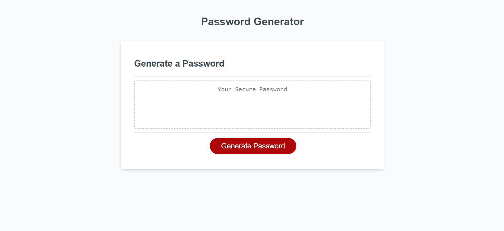

# Password Generator

## Description
* This project modifies starter code to generate a password based on user input. The user must select how long their password should be, and then the user is asked if then want to include uppercase characters,
lowercase characters, numbers, and/or special characters. Once the user has answered the prompts, a password 
meeting that criteria will be generated. 
### Skills
* Math.random() and Math.floor() functions
* alert, confirm, and prompt 
* For loops 
* Arrays 
* Comparisons 
#### Links
https://danielle-l-perry95.githubio/03-challenge-javascript 
https://github.com/danielle-l-perry95/03-challenge-javascript

© 2022 Trilogy Education Services, LLC, a 2U, Inc. brand. Confidential and Proprietary. All Rights Reserved.
